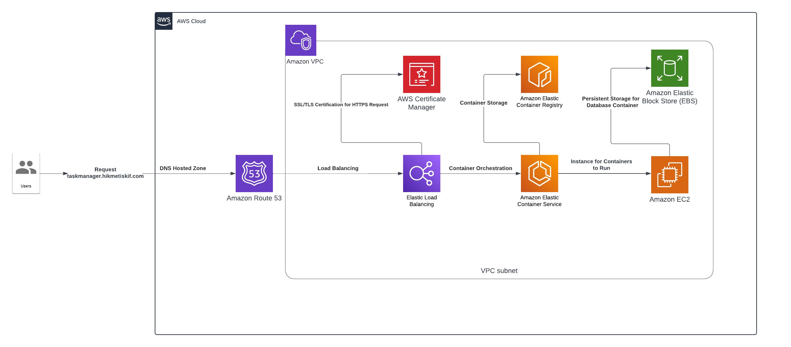

# Kubernetes and AWS ECS Task Manager App
This repository contains a task manager web application built with Python's Flask framework and PostgreSQL database. The application and database are containerized using Docker and can be set up 
using Kubernetes deployment files. Additionally, the containers are deployed on AWS using various AWS services routed to [taskmanager.hikmetiskif.com](https://taskmanager.hikmetiskif.com) . 
(**NOTE:** Due to AWS costs, I stopped the services.)

# About the Application
The application is a web-based task manager that allows users to create, read, update, and delete tasks. It uses PostgreSQL as its database. 
The entire application and the database are containerized with Docker, ensuring consistency across different deployment environments.

# AWS Services Used
AWS services used in this project are:
- **Elastic Container Registry (ECR):** The Docker images for the Flask application and PostgreSQL database are stored in AWS ECR, enabling easy access and management of container images.
- **Elastic Container Service (ECS) with EC2:** ECS is used to deploy and manage the containerized application and database. EC2 instance is configured to run the ECS tasks, providing the computing power needed for the application.
- **Elastic Load Balancing (ELB):** ELB is implemented to distribute incoming traffic across multiple targets, ensuring high availability and reliability of the application.
- **Elastic Block Store (EBS):** EBS is used for persistent storage of the PostgreSQL database container, ensuring that data is not lost even if the container is restarted.
- **Route 53:** AWS Route 53 manages the domain name system (DNS) routing, directing traffic to the ELB from [taskmanager.hikmetiskif.com](https://taskmanager.hikmetiskif.com) .
- **AWS Certificate Manager:** To secure the application, an SSL certificate is obtained through AWS Certificate Manager and attached to the ELB, ensuring encrypted communication between the users and the application.
- **Amazon VPC:** The application is deployed within an Amazon Virtual Private Cloud (VPC), providing network isolation and security for the resources.

# Architecture
The architecture of the project deployed on AWS can be seen in the image below:

# For Kubernetes Deployment
Deployable YAML files can be used to easily deploy the application. The repository also contains seperate YAML files for pods, services and PVC.
To deploy the application, go to the **"/Kubernetes yaml files/deployable yaml files"** folder and run the following command:
- **kubectl apply -f .**

**Note:** Before running the YAML files, don't forget to containerize the application and PostgreSQL database as the deployment files look for them locally.
